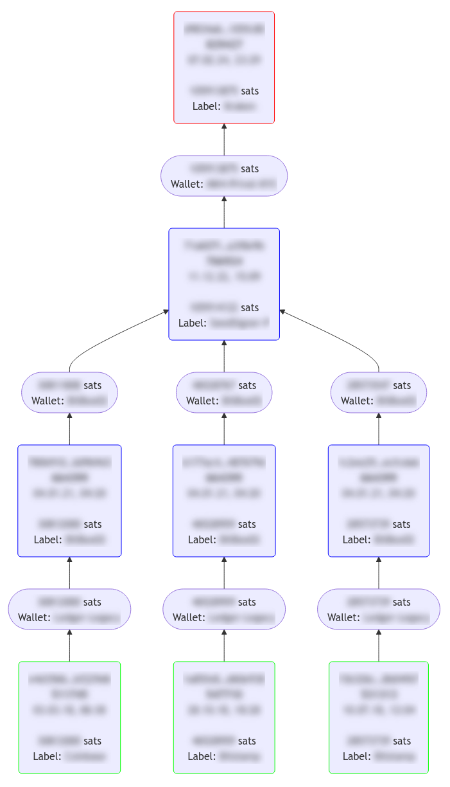

# Bittrailer

- Finds UTXO trails across Sparrow wallet label exports (BIP 329).
- Generates JSON and a flow chart for your personal coin history.
- Privacy-focused accounting option, keeps your data offline.

## Requirements

- [Node.js >= v20](https://nodejs.org/)
- This project on your local computer (either via clone or download)

## Usage

1. Export your wallets from Sparrow via `File > Export Wallet > Labels`.
   Store all of these `*-labels.jsonl` files in a single directory.

2. Configure the path to this directory and an optional custom mempool.space instance:

    ```bash
    export SPARROW_EXPORTS_PATH="../sparrow-labels"
    export MEMPOOL_SPACE_BASE_URL="https://mempool.local"
    ```

3. Run the init script to do the setup and build the index:

    ```bash
    npm run init
    ```

   Whenever you export or update the labels files, refresh the index:

    ```bash
    npm run index
    ```

4. You are ready to go. Lookup a UTXO's trail using the lookup script:

    ```bash
    # Either with just the transaction ID
    npm run lookup TXID [TITLE] [MAX_DEPTH]

    # Or with a distinct vout index
    npm run lookup TXID:VOUT [TITLE] [MAX_DEPTH]
    ```

    The `TITLE` and `MAX_DEPTH` arguments are optional.
    The title is for display purposes and eases finding files by name rather than transaction ID.

    Max depth defines the maximum number of hops to go back in history (default is 99) — this is due to a limitation of the charting library, which might display errors for very large transaction graphs (e.g. ones with coinjoin history). If you encounter these, try increasing the max depth from 10 on.

5. Start the local server to browse the generated files and graphs:

    ```bash
    npm start
    ```

## Sample output


